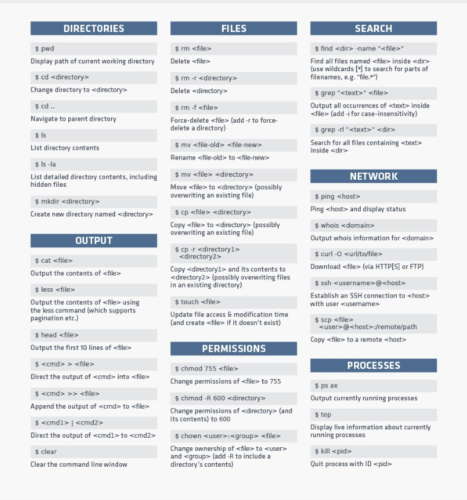

# The Coder's Computer
## Terminal Command List
- everything is a file
- Linux is an extensionless System
-Linux is case sensitive
- space in names
- There are hidden files
- These are the basic markdown list that helped me navigate my terminal
- 
